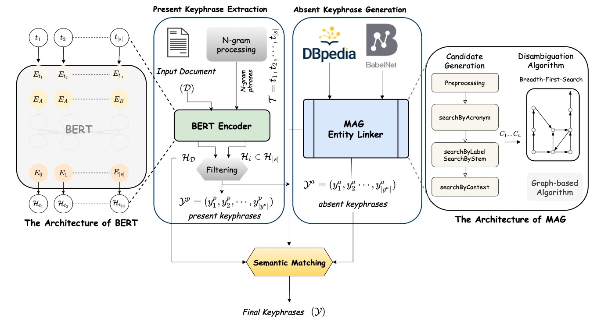

# MultPAX: Keyphrase Extraction using Language Models and Knowledge Graphs
This repositoy contains the source code of paper: *"MultPAX: Keyphrase Extraction using Language models and Knowledge Graphs"*. The paper is currently under-review at the [ISWC 2022 conference](https://iswc2022.semanticweb.org/). 

<p align="center">

</p>
<p align="center">Fig. 1 Architecure of MltPAX Framework</p>


### Summary: 
- Keyphrase extraction is the process of extracting a small set of phrases that best describe an input corpus. 
- The automatic generation of keyphrases has become essential for many natural language applications such as text categorization, indexing, and summarization. 
- In this paper, we propose MultPAX, a multitask framework for extracting *present* and *absent* keyphrases using pretrained language models and knowledge graphs. In particular, our framework contains three components: 
    1) MultPAX identifies present keyphrases from the input corpus.
    2) MultPAX then links the input corpus with external knowledge graphs to get more relevant phrases.
    3) MultPAX ranks the extracted phrases based on their semantic relatedness to input corpus.

### Our Contributions:
```
1) We propose an *unsupervised* multitask framework that not only extracts present keyphrases, but also generate absent ones.
    
2) To the best of our knowledge, our approach is the first attempt that leverages existing knowledge graphs for keyphrase extraction without the need to create keyphrase vocabularies or phrase banks.
    
3) We introduce an embedding-based F1 score that considers semantic similarity between generated and ground-truth keyphrases rather than the existing exact-matching. 
    
4) We carried out several experiments on four benchmark datasets. The evaluation results showed that our approach proved to be more accurate compared with state-of-the-art baselines.  
```    

### Repository Structure:
```
.
├── Baselines
│   ├── EmbedRank-Baseline.ipynb
│   ├── EmbedRank(Wordwise)- Baseline.ipynb
│   ├── TextRank-Baseline.ipynb
│   └── YAKE-Baseline.ipynb
├── Inspec experiment
│   └── MltPAX-Inspec.ipynb
├── Krapivin2009 experiment
│   └── MltPAX-Krapivin2009.ipynb
├── NUS experiment
│   └── MltPAX-NUS.ipynb
├── SemEval2010 experiment
│   └── MltPAX-SemEval2010.ipynb
└── .DS_Store
```

---
## How to run: 
We conduct several experiments on four benchmark datasets, namely: *Inspec, SemEval2010, NUS and Krapivin2009*. The datasets are available at the [Dropbox Folder](https://www.dropbox.com/s/aluvkblymjs7i3r/MULTPAX-Datasets.zip?dl=0). 

To setup the experiments, you need to install the following libraries via `pip install -r requirments.txt` or install them manually: 
```
Python 3.7
keybert
sentence-transformers 2.2.0
SPARQLWrapper 2.0.0
SciPy 1.8.0
NumPy 1.21.5
Pandas 1.4.2
NLTK 3.6.6 
requests 2.27.1
py-babelnet
```

We provide our experiements as Jupyter notebooks (`see Experiments Folder`) and source files (`see src Folder`). We recommend using Jupyter notebooks for an interactive execution of our experiments. Furhtermore, we provide a Jupyter notebook for each experiments:
- [MultPAX-Inspec](Experiments/Inspec%20experiment/MltPAX-Inspec.ipynb) 
- [MultPAX-SemEval](Experiments/SemEval2010%20experiment/MltPAX-SemEval2010.ipynb)
- [MultPAX-NUS](Experiments/NUS%20experiment/MltPAX-NUS.ipynb) 
- [MultPAX-Krapivin2009](Experiments/Krapivin2009%20experiment/MltPAX-Krapivin2009.ipynb)  
  

### Baselines:
We obtain the implementation of baselines: TextRank, YAKE from the [open source library PKE](https://github.com/boudinfl/pke). The source-codes for these baselines are available at:

-  [TextRank](Experiments/Baselines/TextRank-Baseline.ipynb)
-  [YAKE](Experiments/Baselines/YAKE-Baseline.ipynb)

Furthermore, we implemented the EmbedRank using the BERT pretrained model from the [spaCycake]([spacycake](https://github.com/surajiyer/spacycaKE)) library. Our implementation can be found at:

- [EmbedRank](Experiments/Baselines/EmbedRank-Baseline.ipynb) 


For the baseline AutoGen: We obtain the implemenation from its official [GitHub repository](https://github.com/Jayshen0/Unsupervised-Deep-Keyphrase-Generation)

For the baseline CopyRNN, the implemenation can be obtained from its [Github repository](https://github.com/supercoderhawk/deep-keyphrase).


### Evaluation
The following notebooks contains the implementation of the evaluation metrics used in our experiments:


- [F1 evaluation based on exact-matching](Evaluation/F1-Porter-Stemming.ipynb)
- [F1 evaluation based on semantic-matching](Evaluation/F1-Embedding%20Evaluation.ipynb)

---
## Citation
TBD
